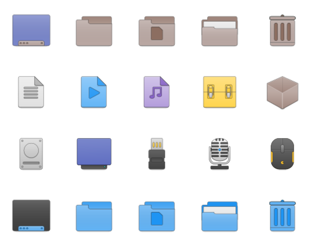

# Newaita noapp

	

This is a fork of [Newaita](https://github.com/cbrnix/Newaita) icon theme where all app icons are removed.

## Installation

### Light

Copy "Newaita" to "~/.icons" or:  
`cp Newaita ~/.icons`

### Dark

Copy "Newaita-dark" to "~/.icons" or:  
`cp Newaita-dark ~/.icons`

## Folders and panel variants

### Opt for a dark or light panel

1. Go to `Newaita` (or `Newaita-dark`) directory
2. Open terminal here
3. Type: chmod +x ./PV.sh
4. Type: ./PV.sh
5. Follow the menu options

### Change folders' color

1. Go to `Newaita` (or `Newaita-dark`) directory
2. Open terminal here
3. Type: chmod +x ./FV.sh
4. Type: ./FV.sh
5. Follow the menu options

## License

This work is licensed under the Creative Commons Attribution-NonCommercial-ShareAlike 3.0 Unported License. 
A copy of the license is available [here](license.pdf) and a summary of that [here](summary.pdf). 

